# Inteligencia de Negocios (BI)

## Información y Conocimiento

### Datos, Información y Conocimiento

Pirámide de jerarquía del conocimiento: cada nivel se obtiene "entendiendo" algo del nivel inferior.

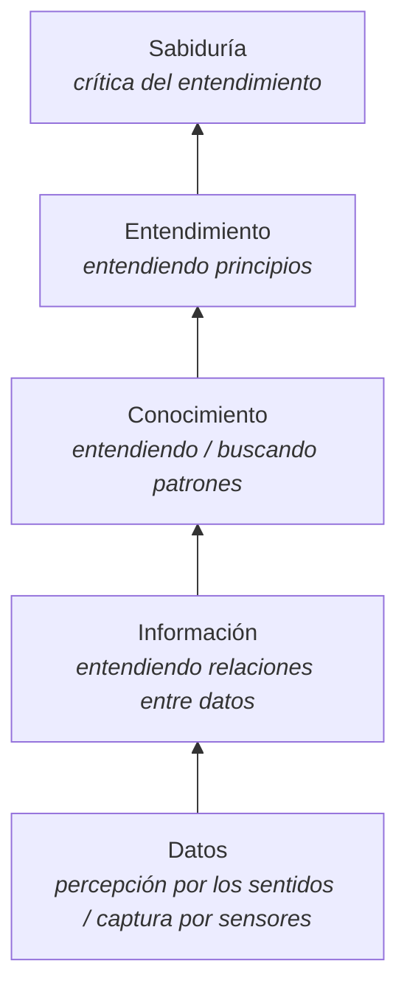

### ¿Qué es el conocimiento?

- Es aquello que permite tomar decisiones.
- Es aquello que responde a la pregunta de ¿cómo ...?
- Es aquello que responde a la pregunta de ¿cuándo tomar una decisión ...?
- Es la información útil.
- Es la experiencia adquirida.

> **Es una actividad principalmente humana para tomar decisiones.**
> El conocimiento está basado en la experiencia y es personal.

## Sistemas OLTP

### Niveles en el uso de los datos

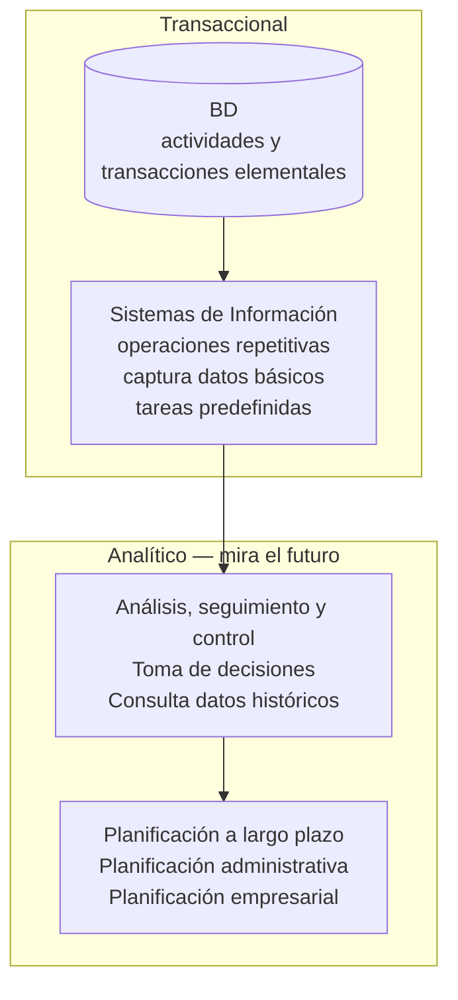

### Sistemas Operacionales

Una BD operacional tiene características como:

- Está orientada a la aplicación.
- Tiene estructuras normalizadas.
- Contiene los datos de las operaciones.
- Los datos se almacenan con el máximo número de detalle.
- Se actualiza en línea.
- Está en constante cambio.

Cada tabla está normalizada para asegurar la integridad de los datos, minimizar el espacio ocupado y maximizar el rendimiento de los datos.

Además:

- Las estructuras de datos son complejas.
- Los sistemas son diseñados para un alto rendimiento de funcionamiento y procesamiento.
- La data está dispersa.
- Pueden no ajustarse a consultas complejas.

**OLTP** (OnLine Transaction Processing) es el Procesamiento de Transacciones En Línea: un tipo de software que administra aplicaciones transaccionales, usualmente para entrada de datos y recuperación y procesamiento de transacciones.

La tecnología OLTP se utiliza en aplicaciones como banca electrónica, procesamiento de pedidos, comercio electrónico, supermercados, industria, etc.

## Sistemas OLAP

### Sistemas Analíticos

| OLAP | Comparación con BD relacional |
|---|---|
| OLAP (On-Line Analytical Processing) es Procesamiento Analítico en Línea. | Una BD relacional almacena entidades en tablas discretas que han sido normalizadas. |
| Es rápido para entregar consultas complejas. | |
| Utiliza estructuras multidimensionales (o Cubos OLAP) que contienen datos resumidos de Sistemas OLTP. | Una BD dimensional almacena los datos en cubos OLAP donde se encuentran calculados y agregados para ser consultados. |

### Sistema OLAP

- Tiene un esquema que está optimizado para que las consultas se ejecuten rápidamente.
- Almacena varios niveles de datos conformados por estructuras altamente optimizadas para consultas.
- Permite el uso interactivo con los usuarios.
- Preparado para realizar informes complejos.
- Proporciona una vista de datos multidimensional (las tablas son bidimensionales).
- Permite cambiar fácilmente las filas, las columnas y las páginas en informes de OLAP.

### Usos

- **Sistemas de información ejecutivos.** Los gerentes necesitan información sobre los indicadores (lo normal y las excepciones o las variaciones).
- **Aplicaciones financieras.** Para comunicar, planear y analizar escenarios de mercado (pronóstico).
- **Ventas y aplicaciones de Marketing.** Análisis de la facturación, análisis de producto, análisis del cliente y análisis de ventas regional.
- **Otros usos.** Análisis de la producción, análisis de servicios al cliente, evolución del costo del producto, etc.

### Sistemas Operacionales vs Analíticos

| | OLTP | OLAP |
|---|---|---|
| Objetivos | Operacionales | Información para la toma de decisiones |
| Orientación | A la aplicación | Al sujeto |
| Vigencia de los datos | Actual | Actual + histórico |
| Granularidad de los datos | Detallada | Detallada + resumida |
| Organización | Organización normalizada | Organización estructurada en función del análisis a realizar |
| Cambios en los datos | Continuos | Estable |

## Inteligencia de Negocios

- La Inteligencia de Negocios es el proceso de transformación de datos en información y, a través del descubrimiento, la transformación de la información en conocimiento.
- Conjunto de técnicas y herramientas que apoyan la toma de decisiones enfocadas a la administración y creación de conocimiento mediante el análisis de datos existentes.

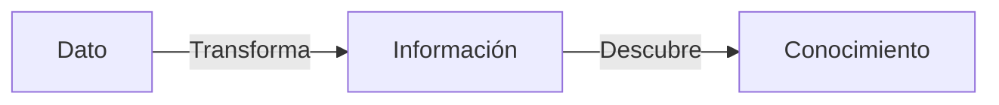

### Finalidad

- Convertir grandes volúmenes de datos en un valor para el negocio a través de los reportes analíticos.
- Generar información para el control de los procesos del negocio, independientemente de la fuente de datos.
- Soportar la toma de decisiones.
- Diferenciar la información útil para los usuarios finales.
- Uniformizar los términos usados en la institución, independientemente del origen de los datos o de la forma de extracción, transformación y agregación.

### Plazo, uso y tecnología

| Plazo | Uso | Técnica | Tecnología | Conocimiento |
|---|---|---|---|---|
| Corto plazo | Gestión de datos, obtención y control | Legacy Systems | OLTP (On-Line Transaction Processing) | Datos — Operativo |
| Mediano plazo | Decisiones tácticas | Data Warehouse | OLAP (On-Line Analytical Processing) | Información — Toma de decisiones |
| Largo plazo | Estratégico, pronóstico | Minería de Datos | Agrupamiento, clasificación, secuenciación, reglas de asociación | Patrones — Nuevos conocimientos |

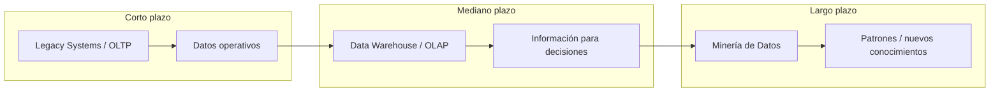

### Evolución

Datos, Información y Conocimiento del Negocio.

| Etapa | Pregunta del negocio | Tecnología disponible | Proveedores | Características |
|---|---|---|---|---|
| Data Collection (1960) | ¿Cuál fue el total de ventas en Lima y en Arequipa? | Computadoras, cintas, discos | IBM, NCR, etc. | Retrospectivo, estático |
| Data Access (1980) | ¿Cuáles fueron las ventas por sucursal en Lima y en Arequipa? | RDBMS, SQL | Oracle, Informix, Sybase, etc. | Retrospectivo, dinámico |
| Data Navigation (1990) | ¿Cuál fue el total de ventas en Lima? Drill Down | OLAP, DW | Pilot, Discoverer, Arbor, etc. | Retrospectivo, dinámico, niveles múltiples |
| Data Mining (2000) | ¿Cómo evolucionarán las ventas en el próximo año? | Algoritmos avanzados, multiprocesadores | Intelligent Miner (IBM), SAS, etc. | Prospectivo, proactivo |

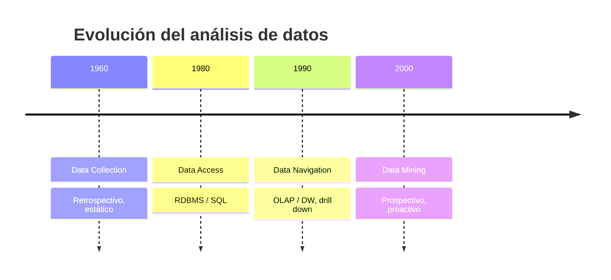

### Disciplinas

- **Business Intelligence.** Tecnologías de almacenamiento de datos, metodologías, análisis de información y software para apoyar la toma de decisiones.
- **Data Warehousing** (cubos, datamart). Estructuras multidimensionales que almacenan información calculada previamente de todas las combinaciones posibles.
- **Knowledge Discovery in DataBases.** Técnicas para la extracción no trivial de información implícita, desconocida y potencialmente útil desde los datos.
- **Data Mining.** Técnica para la extracción de patrones y reglas desde los datos; ayuda a crear nuevos modelos no percibidos por el analista hasta ese momento pero que realmente existen en los datos.

Características comunes:

- Proveen información para el control del proceso de negocio, independientemente de la fuente en la que los datos se encuentran almacenados.
- Dan soporte a la toma de decisiones, siendo esta la característica más importante.
- **La capa semántica.** No se pueden tomar decisiones de negocio si no se habla el lenguaje propio del negocio, independientemente del origen de los datos o de la forma de extracción, transformación y agregación.

> La información le debe "servir" a los usuarios finales en un lenguaje de negocios comprensible por ellos sin la necesidad de intérpretes.
> La idea es que el analista se concentre en la toma de decisiones, las tome con rapidez y seguridad, lo que le ofrece una ventaja competitiva a la empresa y la acerca al cumplimiento de los objetivos.

## ETL

- Los datos de los sistemas OLAP son obtenidos desde los sistemas OLTP.
- Este no es un proceso trivial: existen cientos de potenciales problemas al momento de obtener los datos.

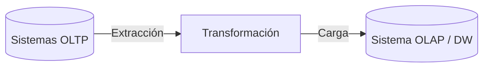

### Problemas potenciales

- Múltiples tecnologías.
- Reportes obsoletos.
- No existía metadata.
- Diferentes algoritmos de cálculo.
- Diferentes niveles de extracción.
- Diferentes niveles de detalle (granularidad).
- Diferentes nombres de campos de datos.
- Diferentes significados de campos de datos.
- Pérdida de información.
- No existían reglas de corrección de datos.
- No existía capacidad de Drill Down.

### Ejemplo — Codificación

- Codificación y descripción del género del individuo.
- Pudo haber sido almacenado de diferentes maneras: "M" y "F", "1" y "0", "Hombre" y "Mujer" ó "Masculino" y "Femenino".
- En la transformación habrá que elegir una convención única para el DW, que puede ser "M" y "F", y transformar los datos.

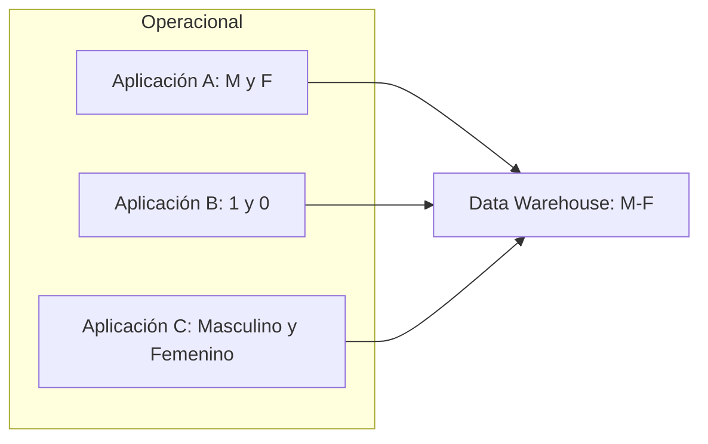

### Ejemplo — Unidades de medida

- Los datos pueden tener distintas unidades de medida según el origen del sistema OLTP; por ejemplo litros, centímetros cúbicos o hectolitros.
- Habrá que elegir una única unidad de medida que sea útil para el DW y transformar los datos.

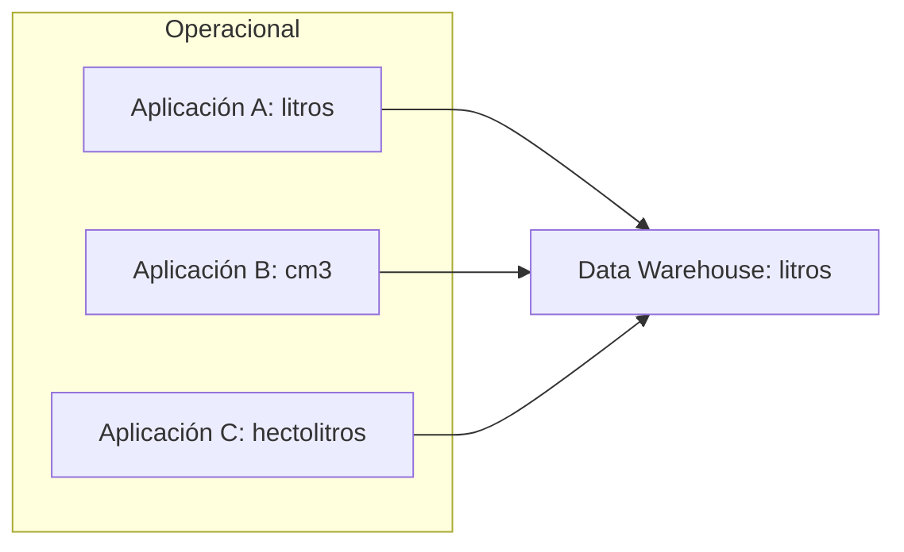

### Ejemplo — Formatos

- Los formatos de fecha en los diferentes sistemas operacionales pueden estar almacenados en múltiples formatos: yyyy/mm/dd, mm/dd/yyyy ó dd/mm/yyyy.
- En el desarrollo del DW debemos elegir alguno de ellos y realizar la transformación correspondiente.

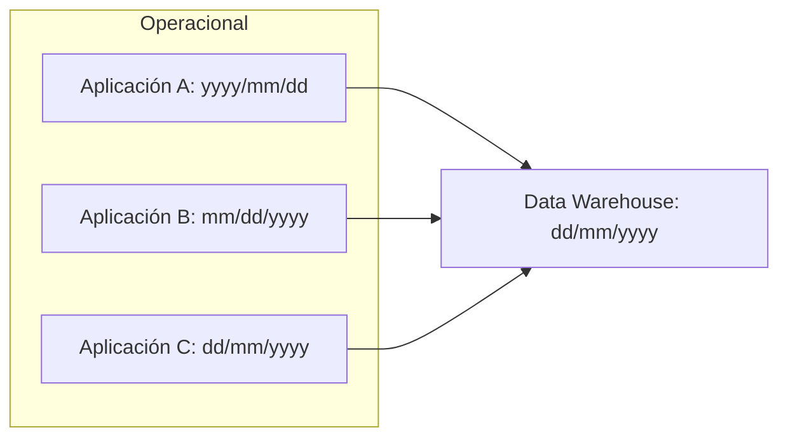

### Ejemplo — Varias columnas en una

- Los datos de una persona, como la dirección, pueden almacenarse en diferentes campos de la misma tabla (Calle, Número, Piso y Departamento).
- En un DW es posible que los almacenemos en una única columna.
- Lo mismo puede suceder con el Nombre y Apellido.

### Ejemplo — Una columna en varias

- Los sistemas antiguos solían colocar el tipo y número de documento en el mismo campo de la tabla.
- En un DW es posible que necesitemos colocar el tipo de documento en un campo y el número de documento en otro.

## Almacenes de Datos

### Data Warehouse

Un almacén de datos (data warehouse) es una colección de datos orientada a un determinado ámbito (empresa, organización, área, tema, etc.), **integrado, no volátil y variable en el tiempo**.

- Ayuda a la toma de decisiones.
- Va más allá de los datos transaccionales y operacionales.
- Favorece el análisis y la divulgación eficiente de datos.
- Contiene gran cantidad de información que se divide en unidades lógicas más pequeñas, denominadas datamarts.

### Ventajas del DWH

- Confiable.
- Controlado.
- Única fuente de datos.
- No duplicación de esfuerzos.
- No conflictos en periodos de tiempo.
- No confusión de algoritmos.
- No restricciones de drill-down.
- Información de calidad.
- No disparidad de data, significado o representación.
- No necesita herramientas para soporte de muchas tecnologías.

### Datamart

- Es una base de datos departamental, especializada en el almacenamiento de los datos de un área de negocio específica.
- Dispone de una estructura óptima de datos para analizar la información al detalle desde todas las perspectivas que afecten a los procesos de dicho departamento.
- Puede ser alimentado desde los datos de un datawarehouse, o integrar por sí mismo un compendio de distintas fuentes de información.

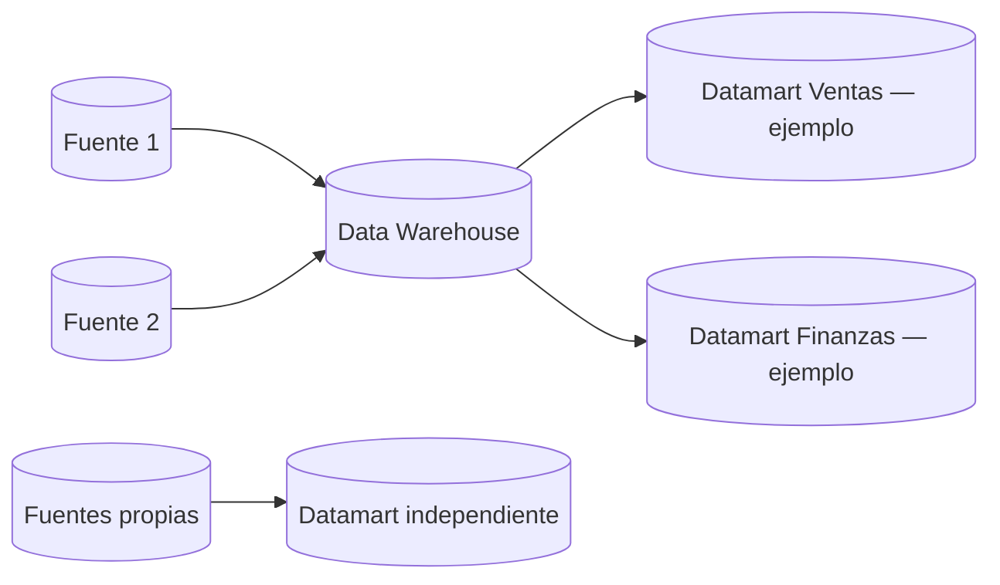

**Datamart OLAP**

- Se basan en los cubos OLAP.
- Se construyen agregando dimensiones e indicadores necesarios en cada cubo.
- Modo de creación, explotación y mantenimiento heterogéneo (depende de la herramienta utilizada).

**Datamart OLTP**

- Se basan en un extracto de un datawarehouse.
- Se introducen mejoras en su rendimiento (agregaciones, filtrados).
- Lo más común son tablas report y vistas materializadas.

### Tecnología

- Hardware
- Sistema Operativo
- Base de Datos
- Herramientas de Consulta
- Aplicaciones

Requerimientos:

- Grandes BD
- Arquitectura de 64 bits
- Técnicas de indización
- Sistemas abiertos
- Herramientas de DW robustas
- Herramientas de usuario final sofisticadas

### Elementos que integran un DW

- **Metadata.** Son los "datos acerca de los datos". Describen la estructura de los datos y cómo se relacionan.
- **API** (Application Programmer Interface, Interfaz de Programación de Aplicación). Lenguaje y formato de mensaje utilizados por un programa para activar e interactuar con las funciones de otro programa o de un equipo físico.
- **Middleware.** Permite asegurar la conectividad entre los componentes de la arquitectura de un DW. Puede verse como capa API, en base a la cual los programadores pueden desarrollar aplicaciones que trabajen en diferentes ambientes sin preocuparse de los protocolos de red y comunicaciones en que correrán.
- **Mecanismos de extracción.** Ya que tenemos grandes volúmenes de datos tanto en los análisis operacionales como en los transaccionales, necesitamos una dinámica para permitir realizar consultas.
- **Mecanismos de carga:**
  - *Acumulación simple:* la más sencilla y común; consiste en realizar un resumen de todas las transacciones comprendidas en el período de tiempo seleccionado y transportar el resultado como una única transacción hacia el DW.
  - *Rolling:* se aplica cuando se opta por mantener varios niveles de granularidad. Se almacena información resumida a distintos niveles, correspondientes a distintas agrupaciones de la unidad de tiempo.

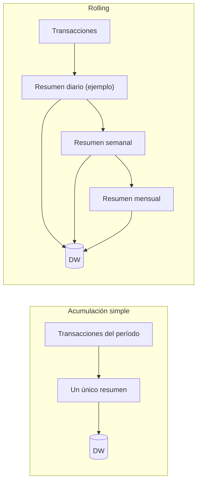

---
*Mg. Samuel Oporto Díaz*
