# OLAP

Arquitectura de un DWH:

- OLTP
- Load Manager
- DW Manager
- Query Manager

## Arquitectura de un Data Warehousing

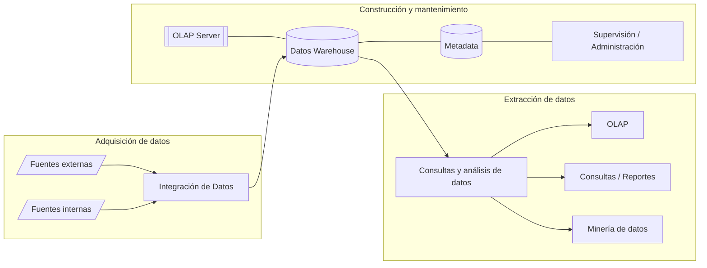

### Arquitectura (componentes)

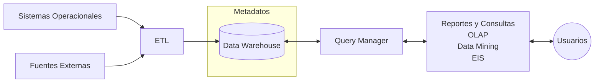

| Etapa | Componente |
|---|---|
| OLTP | Sistemas operacionales y fuentes externas |
| Load Manager | ETL |
| DW Manager | Data Warehouse + metadatos |
| Query Manager | Query Manager |
| Herramientas de consulta y análisis | Reportes y consultas, OLAP, Data Mining, EIS |
| Usuarios | Usuarios finales |

- Los datos son extraídos desde aplicaciones, bases de datos, archivos, etc.
- Los datos son integrados, transformados y limpiados, para ser cargados en el DW.
- La información del DW se estructura en cubos multidimensionales, los cuales preparan esta información para responder a consultas dinámicas con una buena performance.
- Los usuarios acceden a los cubos multidimensionales del DW utilizando herramientas de consulta, exploración, análisis, reportes, etc.

## OLTP

- OLTP (On Line Transaction Processing): información transaccional generada por la empresa en su operación.
- Diferentes formatos, procedencia, función, configuración:
  - Archivos de textos.
  - Hipertextos.
  - Hojas de cálculos.
  - Informes semanales, mensuales, anuales, etc.
  - Bases de datos transaccionales.

## ETL

ETL (Extracción, Transformación y Carga).

- **Extracción.** Desde los OLTP.
- **Transformación.** Manipulación, integración, solución de inconsistencias.
- **Carga.** Carga en el DWH.

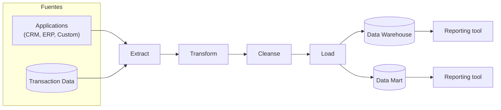

### ETL. Extracción

- Extrae los datos relevantes desde diversas fuentes OLTP: CRM, ERP, TXT, aplicaciones a la medida, otras.
- Procesamiento sin paralizar el OLTP ni el DWH.
- Gestiona los metadatos del proceso ETL.
- Facilita la integración de fuentes internas y externas.
- Tablas auxiliares y temporales para cálculos intermedios.
- El DWH se puebla desde estas tablas.

### ETL. Transformación

Convierte datos inconsistentes en datos compatibles y congruentes, para ser cargados en el DW:

- Codificación.
- Medida de atributos.
- Convenciones de nombramiento.
- Fuentes múltiples.

Limpieza de Datos (Data Cleaning):

- Datos no existentes (missing values).
- Datos extremos (outliers).

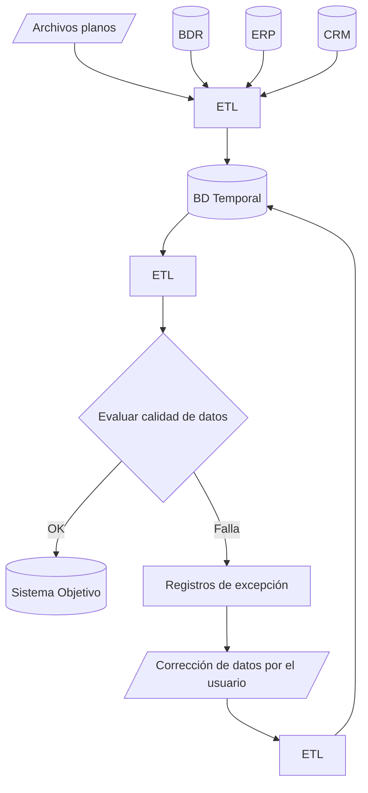

Ejemplos de cada tipo de transformación (OLTP → Data Warehouse):

| Tipo | Valores en el OLTP | Valor en el DW |
|---|---|---|
| Codificación | off, on / 0, 1 / Apagado, Encendido | 0, 1 |
| Medida de atributos | centímetros / metros / pulgadas | metros |
| Convenciones de nombramiento | nombre / razón_social / proveedor | proveedor |
| Fuentes múltiples | descripción / descripción / descripción | descripción |

**Datos no existentes.** El dato no existe porque:

- No fue registrado en el momento.
- En la integración de BD, una de ellas no tiene esa columna.

**Datos extremos.** Se presentan porque:

- Caso excepcional.
- Error de digitación.

### ETL. Carga

Carga el DWH con:

- Datos transformados que residen en tablas temporales.
- Datos de OLTP que tienen correspondencia directa.

### El proceso ETL

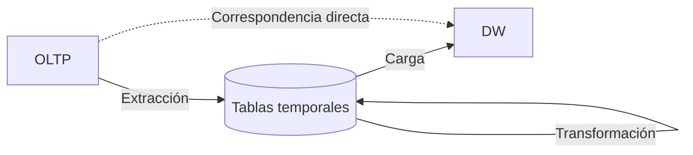

- **Extracción.** Se extraen datos relevantes desde los OLTP y se depositan en tablas temporales.
- **Transformación.** Se integran y transforman los datos en las tablas temporales para evitar inconsistencias.
- **Carga.** Se carga desde las tablas temporales al DWH.

> Si existe correspondencia directa entre los datos del OLTP y del DWH, se procede a la carga.

### Tareas del ETL

- **Initial Load (Carga Inicial)**
  - Primera carga.
  - Movimiento de gran cantidad de datos.
  - Fuerte consumo de tiempo.
- **Incremental Load (Carga Incremental o actualización)**
  - Mantenimiento o refresco periódico (frecuencia de actualización).
  - Movimiento de pocos datos (nuevos o modificados).
  - Problema: control de cambios (desde la fecha anterior):
    - Identificar las instancias de los OLTP involucradas.
    - Utilizar disparadores (triggers) en los OLTP.
    - Recurrir a marcas de tiempo (Time Stamp).
    - Comparar los datos existentes en los dos ambientes (OLTP y DW).
- **Full Load (Carga total)**
  - Si el control de cambios es complejo, cargar desde cero.

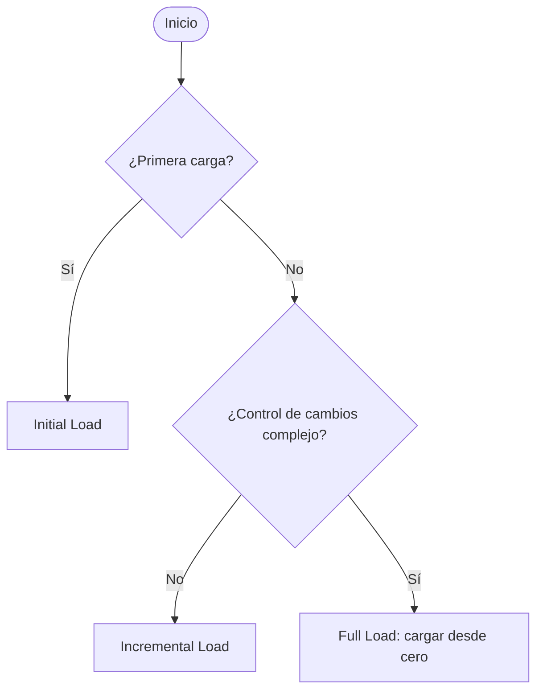

## Administración del DWH

- Transforma los datos fuentes en un modelo dimensional.
- Gestiona los datos mediante tablas de hechos y de dimensiones (repositorio de datos).
- Las tablas de hechos y dimensiones permiten crear cubos OLAP.
- Permite ejecutar sentencias MDX (Multidimensional Expressions).
- Define las políticas de particionamiento de la tabla de hechos para mejorar la eficiencia de las consultas.
- Ejecuta copias de respaldo.

## Base de Datos Multidimensionales

- Una BDMD se usa para crear aplicaciones OLAP.
- Cada tabla almacena registros de la forma: `D1, D2, D3, … M1, M2, M3, …`
- Cada tabla se relaciona a un hipercubo (o un cubo OLAP).

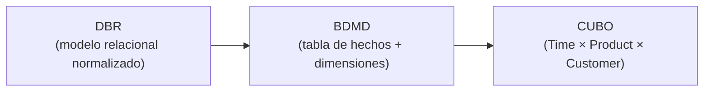

Ejemplo de tabla de hechos (Fact Table):

| Dimensiones | Medidas |
|---|---|
| Time, Product, Customer, Employee | Total, Quantity, Freight, Descount |

- **Di es una dimensión**
  - Describe un aspecto del negocio.
  - Define la organización lógica de los datos.
  - Provee un medio para analizar datos del negocio.
  - Permite filtrar y manipular los datos almacenados.
- **Mi es una medida (hecho)**
  - Siempre son numéricas.
  - Cruzan todas las dimensiones en todos los niveles.
  - Son indicadores sumarizados (sumas, promedios, mínimo, máximo, total, %).

## Modelos Multidimensionales

- Esquema en Estrella (Star Scheme).
- Esquema Copo de Nieve (Snowflake Scheme).
- Esquema Constelación (Starflake Scheme).

### Esquema Estrella

Una tabla de hechos central (`F_SALES`) rodeada de tablas de dimensiones. Las primeras columnas de la tabla de hechos son las claves de las dimensiones; las restantes son las medidas o hechos.

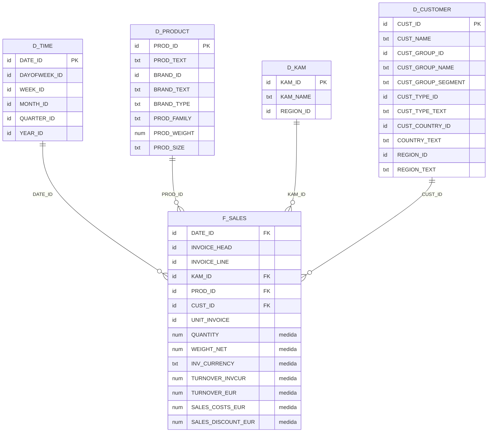

### Esquema Copo de Nieve

> **Nota:** en la diapositiva con este título aparecen **dos tablas de hechos** (`F_SALES` y `F_FORECAST`) compartiendo dimensiones, que en la literatura habitual corresponde al esquema *constelación*. Se transcribe tal como está en la diapositiva.

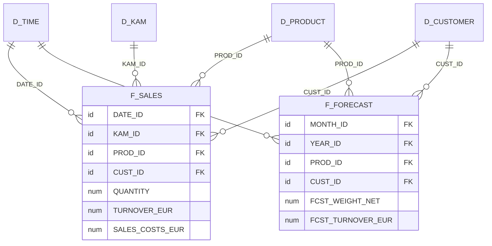

(Las dimensiones `D_TIME`, `D_PRODUCT`, `D_KAM` y `D_CUSTOMER` tienen las mismas columnas que en el esquema estrella.)

### Esquema Constelación

> **Nota:** en la diapositiva con este título aparece **una sola tabla de hechos** con dimensiones **normalizadas** (`D_PRODUCT → D_BRAND`, `D_CUSTOMER → D_CUSTOMER_GROUP`, `D_CUSTOMER → D_COUNTRY`), que en la literatura habitual corresponde al esquema *copo de nieve*. Se transcribe tal como está en la diapositiva.

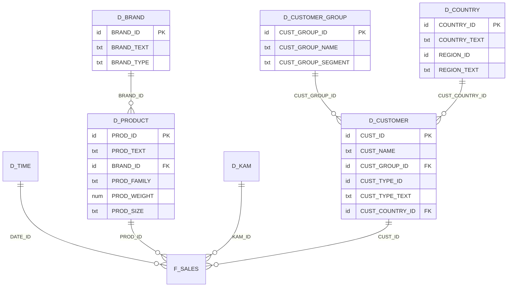

### Tabla de dimensiones

- Definen la organización lógica de los datos. Ejemplo:

| GEOGRAFIA | PRODUCTOS | CLIENTES | FECHAS |
|---|---|---|---|
| id_Geografia (PK) | id_Producto (PK) | id_Cliente (PK) | id_Fecha (PK) |
| País | Rubro | NombreCliente | Año |
| Provincia | Tipo | | Trimestre |
| Ciudad | NombreProducto | | Mes |
| Barrio | | | Día |

- Tiene una PK (única) y columnas de referencia:
  - Clave principal (PK) o identificador único.
  - Claves foráneas.
  - Datos de referencia primarios (identifican la dimensión).
  - Datos de referencia secundarios (complementan la descripción).
- No siempre la PK del OLTP corresponde con la PK de la tabla de dimensión relacionada (¿por qué?).

### Tablas de Hechos

- Las tablas de hechos contienen hechos.
- Los hechos o medidas son los valores de datos que se analizan (son numéricos).
- La tabla de hechos tiene una **clave primaria compuesta** por las claves primarias de las tablas de dimensiones relacionadas a ella.

> Los hechos son aquellos datos que residen en una tabla de hechos y que son utilizados para crear indicadores, a través de sumarizaciones preestablecidas al momento de crear un cubo multidimensional.

### Hechos o medidas

Las medidas representan los valores que son analizados:

- Cantidad de pacientes admitidos.
- Llamadas efectuadas.
- `ImporteTotal = precioProducto * cantidadVendida`
- `Rentabilidad = utilidad / PN`
- `CantidadVentas = cantidad`
- `PromedioGeneral = AVG(notasFinales)`

Son valores numéricos porque son la base de la cual el usuario puede realizar cálculos. Si la medida es no numérica debemos codificarla a un valor numérico y, cuando tengamos que exponerla, decodificarla para mostrarla con el valor original.

Características de las medidas:

- Deben ser numéricas.
- Cruzan todas las dimensiones en todos los niveles.

Las medidas pueden clasificarse en:

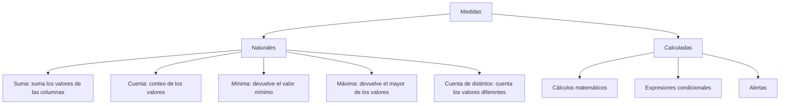

## Cubos Multidimensionales o hipercubos

- Representa o convierte datos planos que se encuentran en filas y columnas en una matriz de N dimensiones.
- Los **atributos** existen a lo largo de varios ejes o dimensiones y la intersección de ellas representa el valor que tomará el **indicador**.

Ejemplo: `Indicador 1 = (Atributo 1, Valor 5; Atributo 2, Valor 4; Atributo 3, Valor 3)`.

### La idea de multidimensionalidad

El hecho *Sales* en el centro, con 3 dimensiones; cada una con niveles de granularidad:

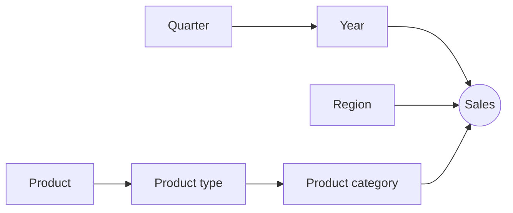

### El Cubo

Ejes: **Región** (Vaud, Fribourg, Neuchatel), **Tipo de Producto** (Mobiles, Fax, Standard) y **Año** (1997, 1998, 1999). Cada celda es un valor del indicador; por ejemplo, la celda resaltada corresponde a *Ventas de teléfonos Standard en 1997 en la región Vaud*.

## Indicadores, Atributos y Jerarquías

Los objetos a incluir en un cubo son:

- Los **indicadores**: sumarizaciones (suma, conteo, promedio, etc.) efectuadas sobre algún **hecho**. Dependen de los atributos/jerarquías que se utilicen para analizarlos.
- Los **atributos**: criterios utilizados para analizar los indicadores. Se basan en los datos de referencia de las tablas de **dimensiones**. En un cubo, los atributos son los ejes del mismo. Son campos o criterios de análisis pertenecientes a tablas de dimensiones.

Una **jerarquía** representa una relación lógica entre dos o más atributos, si poseen una relación "padre-hijo". Características:

- Existen varias en un mismo cubo.
- Tienen dos o más niveles.
- Relación "1-n" o "padre-hijo" entre atributos consecutivos de un nivel superior y uno inferior.
- Se pueden identificar cuando existen relaciones "1-n" o "padre-hijo" entre los propios atributos de un cubo.

Ejemplos de jerarquías de la diapositiva:

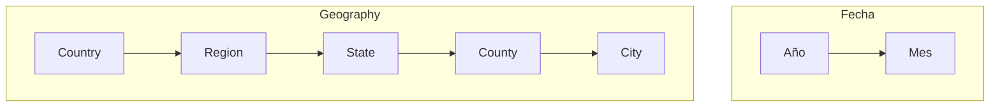

## Granularidad

- La granularidad es el **nivel de detalle** en que se almacena la información.
- Por ejemplo:
  - Datos de ventas o compras de una empresa pueden registrarse día a día.
  - Datos pertinentes a pagos de sueldos o cuotas de socios podrán almacenarse a nivel de mes.
- A mayor nivel de detalle, mayor posibilidad analítica, ya que los mismos podrán ser resumidos o sumarizados.
- Los datos con granularidad fina (nivel de detalle) podrán ser resumidos hasta obtener una granularidad media o gruesa. No sucede lo mismo en sentido contrario.

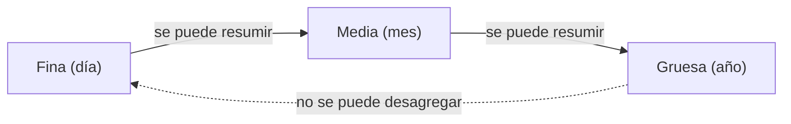

## Consultas

- Ejecuta consultas relacionales, tales como Join y agregaciones, y consultas propias del análisis de datos, como drill-up y drill-down.
- Una consulta consiste en obtener **indicadores** desde una tabla de hechos, restringidas por las propiedades o condiciones de los **atributos**.
- Las operaciones pueden ser:
  - Drill-down.
  - Drill-up.
  - Drill-across.
  - Roll-across.
  - Pivot.
  - Page.

### Ejemplo

Sea el siguiente esquema estrella:

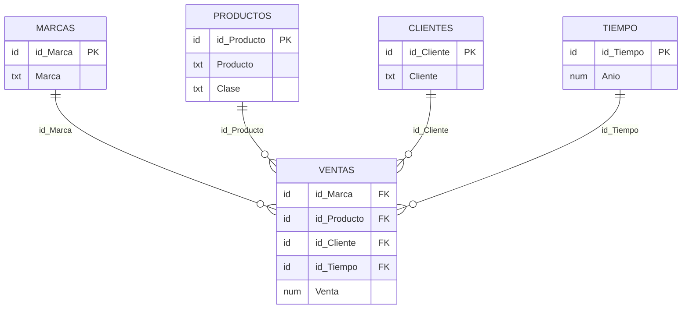

Cubo definido en el Query Manager:

- Atributos: `MARCAS - Marca`, `TIEMPO - Año`, `PRODUCTOS - Producto`, `PRODUCTOS - Clase`
- Indicador: `VENTAS - Venta` (= `SUM(VENTAS.Venta)`)
- Jerarquía PRODUCTOS: `Producto → Clase`

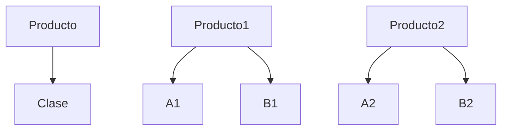

### Mapa de las operaciones

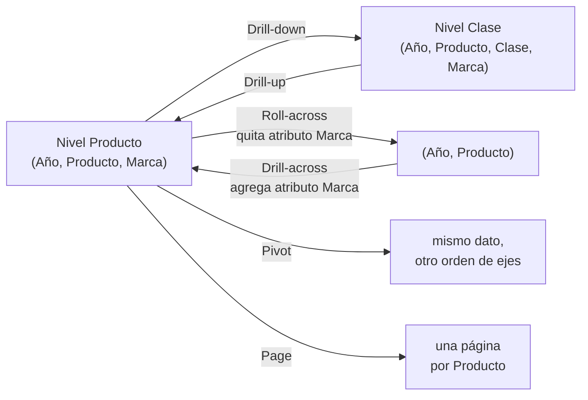

### Drill-down

Baja en la jerarquía (Producto → Clase) para ver más detalle.

Antes (nivel Producto):

| TIEMPO - Año | PRODUCTOS - Producto | MARCAS - Marca | VENTAS - Venta |
|---|---|---|---|
| 2007 | Producto1 | M1 | 40 |
| 2007 | Producto1 | M2 | 52 |
| 2007 | Producto1 | M3 | 25 |
| 2007 | Producto2 | M1 | 39 |
| 2007 | Producto2 | M2 | 65 |
| 2007 | Producto2 | M3 | 48 |

Después (nivel Clase), matricialmente:

| Producto → Clase | M1 | M2 | M3 |
|---|---|---|---|
| Producto1 → A1 | 22 | 33 | 15 |
| Producto1 → B1 | 18 | 19 | 10 |
| Producto2 → A2 | 21 | 30 | 26 |
| Producto2 → B2 | 18 | 35 | 22 |

### Drill-up

Operación inversa: sube en la jerarquía (Clase → Producto), sumarizando. Desde la tabla por Clase se obtiene:

| Producto | M1 | M2 | M3 |
|---|---|---|---|
| Producto1 | 22+18 = 40 | 33+19 = 52 | 15+10 = 25 |
| Producto2 | 21+18 = 39 | 30+35 = 65 | 26+22 = 48 |

### Drill-across

Se analiza a mayor detalle **agregando un criterio más** (un atributo de otra dimensión).

Antes:

| TIEMPO - Año | PRODUCTOS - Producto | VENTAS - Venta |
|---|---|---|
| 2007 | Producto1 | 117 |
| 2007 | Producto2 | 152 |

Después (se agrega `MARCAS - Marca`):

| TIEMPO - Año | PRODUCTOS - Producto | MARCAS - Marca | VENTAS - Venta |
|---|---|---|---|
| 2007 | Producto1 | M1 | 40 |
| 2007 | Producto1 | M2 | 52 |
| 2007 | Producto1 | M3 | 25 |
| 2007 | Producto2 | M1 | 39 |
| 2007 | Producto2 | M2 | 65 |
| 2007 | Producto2 | M3 | 48 |

### Roll-across

Operación inversa del drill-across: se **quita un criterio** (Marca) y se sumariza.

| TIEMPO - Año | PRODUCTOS - Producto | VENTAS - Venta |
|---|---|---|
| 2007 | Producto1 | 40+52+25 = 117 |
| 2007 | Producto2 | 39+65+48 = 152 |

### Pivot

Selecciona el orden de visualización de atributos e indicadores. Los datos no cambian, solo la posición de los ejes.

Antes:

| MARCAS - Marca | TIEMPO - Año | PRODUCTOS - Producto | VENTAS - Venta |
|---|---|---|---|
| M1 | 2007 | Producto1 | 40 |
| M1 | 2007 | Producto2 | 39 |
| M2 | 2007 | Producto1 | 52 |
| M2 | 2007 | Producto2 | 65 |
| M3 | 2007 | Producto1 | 25 |
| M3 | 2007 | Producto2 | 48 |

Después:

| TIEMPO - Año | PRODUCTOS - Producto | MARCAS - Marca | VENTAS - Venta |
|---|---|---|---|
| 2007 | Producto1 | M1 | 40 |
| 2007 | Producto1 | M2 | 52 |
| 2007 | Producto1 | M3 | 25 |
| 2007 | Producto2 | M1 | 39 |
| 2007 | Producto2 | M2 | 65 |
| 2007 | Producto2 | M3 | 48 |

Pivot permite realizar las siguientes acciones:

1. Mover un atributo o indicador desde el encabezado de fila al encabezado de columna.
2. Mover un atributo o indicador desde el encabezado de columna al encabezado de fila.
3. Cambiar el orden de los atributos o indicadores del encabezado de columna.
4. Cambiar el orden de los atributos o indicadores del encabezado de fila.

### Page

Presenta el cubo dividido en secciones, mediante valores de un atributo, como si se tratase de páginas de un libro. Es muy útil cuando las consultas devuelven muchos registros y es necesario desplazarse por los datos para poder verlos en su totalidad.

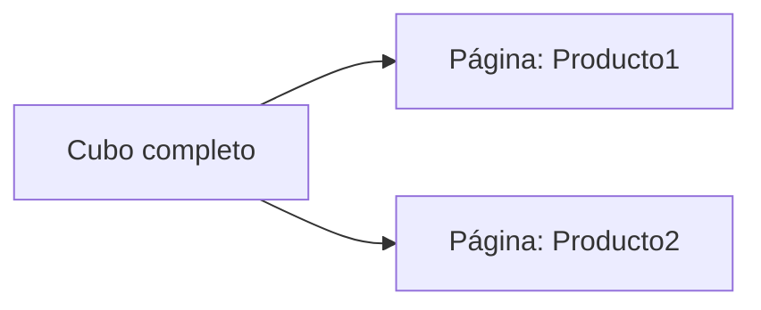

Página **Producto1**:

| TIEMPO - Año | MARCAS - Marca | VENTAS - Venta |
|---|---|---|
| 2007 | M1 | 40 |
| 2007 | M2 | 52 |
| 2007 | M3 | 25 |

Página **Producto2**:

| TIEMPO - Año | MARCAS - Marca | VENTAS - Venta |
|---|---|---|
| 2007 | M1 | 39 |
| 2007 | M2 | 65 |
| 2007 | M3 | 48 |

---
*Mg. Samuel Oporto Díaz*
